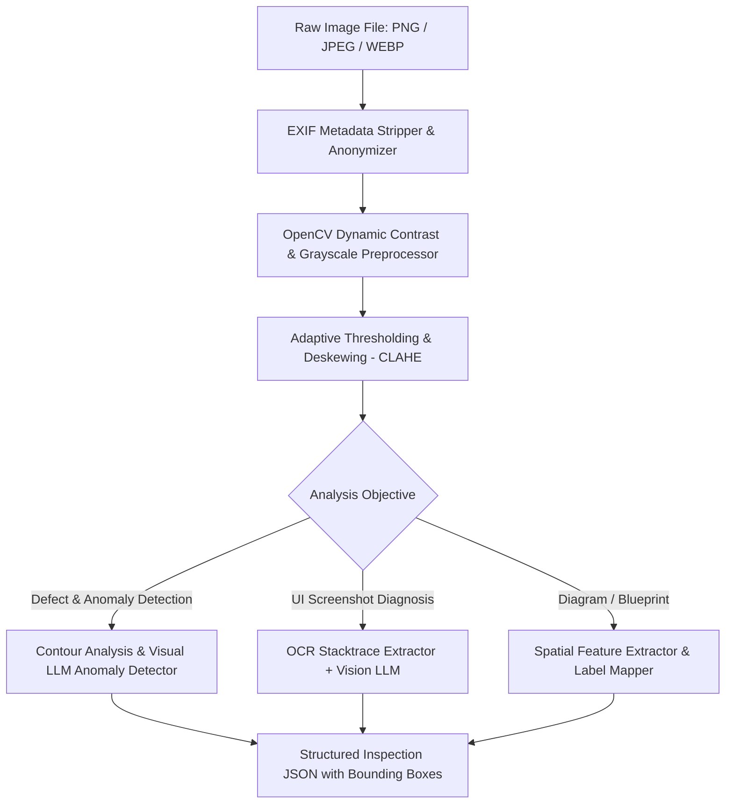

# Multimodal — Computer Vision & Image Processing Engine

## Status
**Status:** ✅ IMPLEMENTED (OpenCV Preprocessing & Multimodal Vision LLMs)

---

## 1. Image Processing Architecture

The **Image Processing Engine** (`app.multimodal.vision`) prepares and analyzes raw visual inputs, including factory equipment photographs, user bug screenshots, and engineering schematics.

---

## 2. Preprocessing & Enhancement Algorithms

1. **EXIF Sanitization:** Removes GPS coordinates, device serial numbers, and camera timestamps to protect employee and facility privacy.
2. **CLAHE (Contrast Limited Adaptive Histogram Equalization):** Enhances local contrast in low-light factory photos to reveal hairline fractures or oil leaks.
3. **Automated Deskewing:** Calculates orientation angle via Radon transform / Hough lines and rotates skewed mobile photos to standard 0° alignment.
