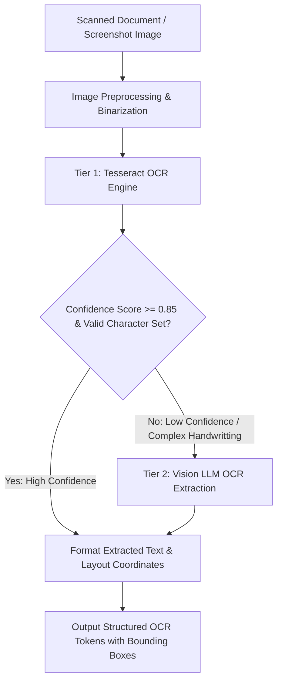

# Multimodal — Hybrid Optical Character Recognition (OCR) Engine

## Status
**Status:** ✅ IMPLEMENTED (Tesseract & Vision LLM Hybrid Pipeline)

---

## 1. Hybrid OCR Architecture

OmniAgent AI utilizes a **two-tier hybrid OCR approach** that balances speed, cost, and high-accuracy text extraction from degraded, handwritten, or multilingual documents.

---

## 2. OCR Engine Comparison

| Engine Tier | Processing Core | Typical Latency | Strength | Weakness |
| :--- | :--- | :--- | :--- | :--- |
| **Tier 1 (Fast Local)** | Tesseract 5.3 (LSTM engine) | ~ 180 ms / page | Fast, zero API cost, excellent on standard printed fonts. | Degrades on skewed angles, low contrast, and handwriting. |
| **Tier 2 (Vision LLM)** | GPT-4o Vision / Claude 3.5 Sonnet | ~ 1,400 ms / page | Unmatched accuracy on handwriting, receipts, and watermarked forms. | Higher token cost and API latency. |

---

## 3. Post-Processing & Error Correction

* **Spell Check & Dictionary Correction:** Uses SymSpell with domain-specific dictionaries (medical, legal, financial terms).
* **Regex Entity Anchoring:** Normalizes extracted dates (`YYYY-MM-DD`), currency strings (`$#,###.##`), and serial numbers.
