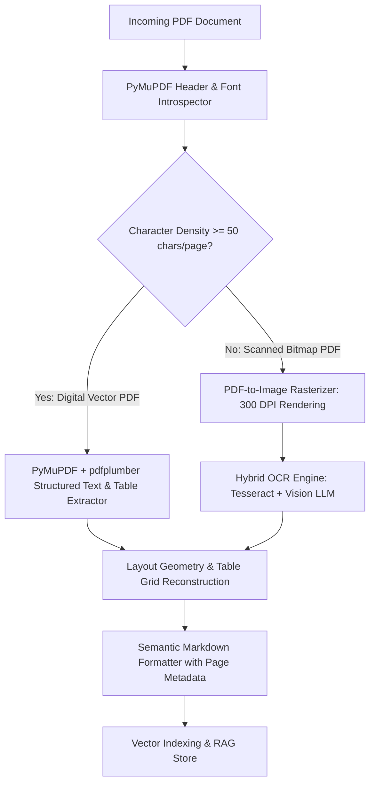

# Multimodal — High-Fidelity PDF Processing & Layout Analysis

## Status
**Status:** ✅ IMPLEMENTED (PyMuPDF + pdfplumber Hybrid Pipeline)

---

## 1. PDF Ingestion Architecture

PDFs represent the predominant format for enterprise knowledge, financial statements, and technical manuals. OmniAgent AI deploys a **dual-mode PDF extraction engine** that automatically determines whether a document is a digital vector PDF or a scanned bitmap, applying the optimal extraction strategy.

---

## 2. Table & Layout Reconstruction

* **Table Extraction:** Uses `pdfplumber` line-intersection detection algorithms to convert complex multi-column financial balance sheets into structured Markdown tables.
* **Header Hierarchy Detection:** Inspects font sizes and weights in PyMuPDF spans to reconstruct Markdown `#`, `##`, `###` heading outlines.
* **Bounding Box Tracking:** Associates every extracted text block with its page coordinate rectangle `(x0, y0, x1, y1)` for instant visual highlighting in the Next.js PDF viewer.
