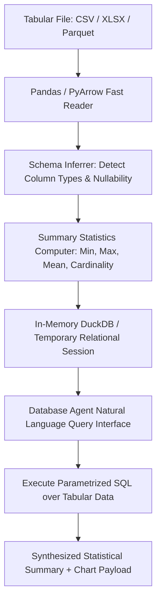

# Multimodal — Structured & Tabular Data Ingestion Engine

## Status
**Status:** ✅ IMPLEMENTED (Pandas Dataframes, Schema Inference & SQL Synthesis)

---

## 1. Structured Data Architecture

The **Structured Data Engine** (`app.multimodal.tabular`) ingests relational CSV files, multi-sheet Excel workbooks, and Parquet data files, converting them into optimized in-memory Pandas dataframes and temporary DuckDB/PostgreSQL query tables for analytical reasoning.

---

## 2. Dynamic Schema Linearization

To allow LLMs to reason over large tabular files without blowing token context budgets:
* Columns and types are linearized into a compact schema header:
  `table_sales(id INT, region VARCHAR(32), revenue NUMERIC(12,2), timestamp TIMESTAMP)`
* A sample of top 3 sample rows and distribution statistics is passed to the Database Agent rather than the entire 50,000-row table.
* The Database Agent writes precise SQL queries executed natively against the data.
