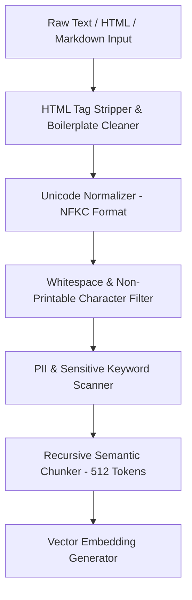

# Multimodal — Text & Document Normalization Engine

## Status
**Status:** ✅ IMPLEMENTED (Plaintext, Markdown & HTML Ingestion)

---

## 1. Text Normalization Pipeline

The **Text Processing Engine** (`app.multimodal.text`) normalizes raw unstructured text streams, HTML emails, markdown documentation, and scraped web pages into standardized semantic chunks ready for vector indexing.

---

## 2. Text Ingestion Specifications

| Attribute | Specification | Implementation Detail |
| :--- | :--- | :--- |
| **Supported Formats** | `.txt`, `.md`, `.html`, `.xml`, `.json` | Processed via native Python streaming buffers. |
| **Unicode Handling** | NFKC Normalization | Converts full-width characters, ligature symbols, and non-breaking spaces. |
| **HTML Sanitization** | `selectolax` + `readability-lxml` | Strips navigation menus, ads, footer links, leaving clean article text. |
| **PII Redaction** | Regex & Named Entity Recognition | Masks SSNs, credit card numbers, and secret tokens before embedding. |
| **Throughput** | > 15 MB / second | Non-blocking asynchronous ingestion worker. |
