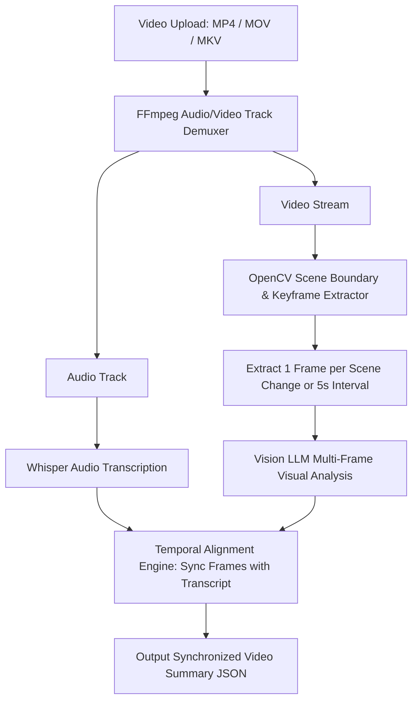

# Multimodal — Video Processing & Scene Analysis

## Status
**Status:** 🚧 PARTIALLY IMPLEMENTED (Keyframe Extraction & Audio Transcription Active; Scene Graph in Progress)

---

## 1. Video Processing Pipeline

The **Video Ingestion Subsystem** decomposes multi-gigabyte enterprise video files (e.g., recorded Zoom meetings, factory surveillance clips, machine operation footage) into synchronized visual keyframes and audio speech transcripts.

---

## 2. Keyframe Extraction Strategy

1. **Scene Transition Detection:** Computes structural similarity index (SSIM) between consecutive frames; when difference exceeds 30%, a new keyframe is captured.
2. **Text & Slide Detection:** Automatically identifies slide presentations in video and triggers high-resolution OCR capture.
3. **Temporal Bounding:** Every visual observation is tagged with start and end timestamps `(t_start, t_end)` matching the speech transcript.
