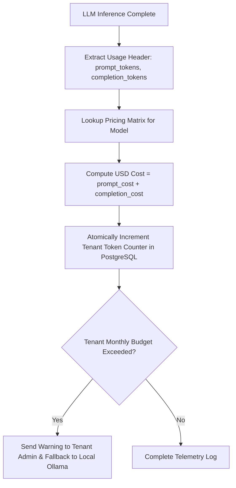

# Observability — Token Metering & LLM Cost Attribution

## Status
**Status:** ✅ IMPLEMENTED (Token Counting & Tenant Cost Attribution)

---

## 1. Token Metering Architecture

Every interaction with foundation LLM providers (Claude 3.5 Sonnet, GPT-4o, Gemini 1.5 Pro) captures exact prompt and completion token counts. The platform computes real-time dollar costs and attributes them to specific departments and tenants.



---

## 2. Model Pricing Configuration Matrix

```json
{
  "claude-3-5-sonnet": {
    "prompt_cost_per_1m": 3.00,
    "completion_cost_per_1m": 15.00
  },
  "gpt-4o": {
    "prompt_cost_per_1m": 5.00,
    "completion_cost_per_1m": 15.00
  },
  "claude-3-5-haiku": {
    "prompt_cost_per_1m": 0.80,
    "completion_cost_per_1m": 4.00
  },
  "ollama-local": {
    "prompt_cost_per_1m": 0.00,
    "completion_cost_per_1m": 0.00
  }
}
```
