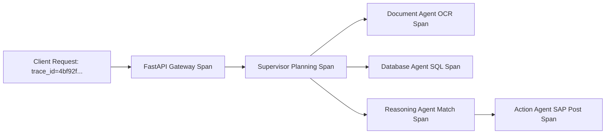

# Observability — Distributed Tracing (OpenTelemetry)

## Status
**Status:** ✅ IMPLEMENTED (OpenTelemetry Instrumentation)

---

## 1. Distributed Tracing Topology

OmniAgent AI propagates `traceparent` context across FastAPI endpoints, LangGraph agent states, and asynchronous Celery tasks, allowing end-to-end trace visualization in Jaeger or OpenSearch.

Every database query, Redis checkpointer access, and external API call generates a correlated child span with execution timestamps and error flags.
