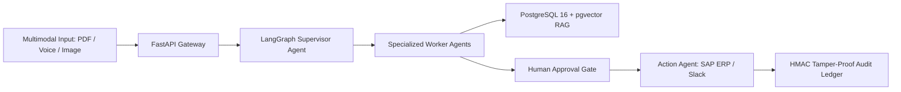

# Portfolio — Case Study & Portfolio Project Description

---

## 1. Project Title & Overview
**OmniAgent AI — Enterprise Multimodal AI Employee & Automation Platform**
* An autonomous digital employee capable of ingesting cross-modal inputs (PDFs, images, voice, spreadsheets, SQL databases) to execute complex, multi-department enterprise workflows with deterministic safety and human oversight.

---

## 2. Key Architecture & Engineering Highlights

### Core Problems Solved
* **Unstructured Ingestion Bottleneck:** Replaced manual document re-keying with high-accuracy PyMuPDF, pdfplumber, and OCR extraction.
* **Autonomous Decision Safety:** Eliminated unvetted AI mutations by implementing a 3-tier risk classification engine that enforces human authorization on financial and operational mutations.
* **Enterprise Grounding:** Prevented hallucinations via hybrid vector (pgvector) and sparse BM25 search with Cross-Encoder reranking.
