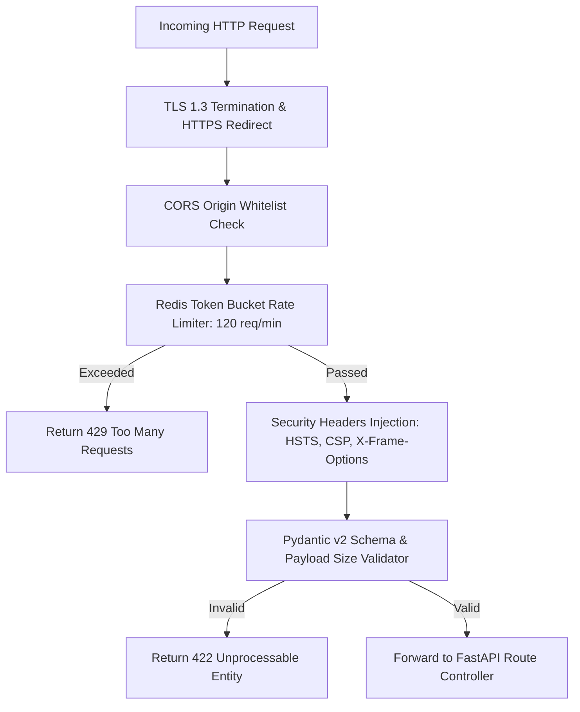

# Security — API Security, Rate Limiting & Input Validation

## Status
**Status:** ✅ IMPLEMENTED (Pydantic v2, Redis Rate Limiting, CORS & HTTPS)

---

## 1. API Security Architecture

OmniAgent AI secures its public and internal API surfaces against automated scraping, credential stuffing, and injection attacks.

---

## 2. Security Headers Configuration

FastAPI injects strict enterprise security headers on every response:
* `Strict-Transport-Security: max-age=63072000; includeSubDomains; preload`
* `X-Content-Type-Options: nosniff`
* `X-Frame-Options: DENY`
* `Content-Security-Policy: default-src 'self'; script-src 'self';`
* `Referrer-Policy: strict-origin-when-cross-origin`
