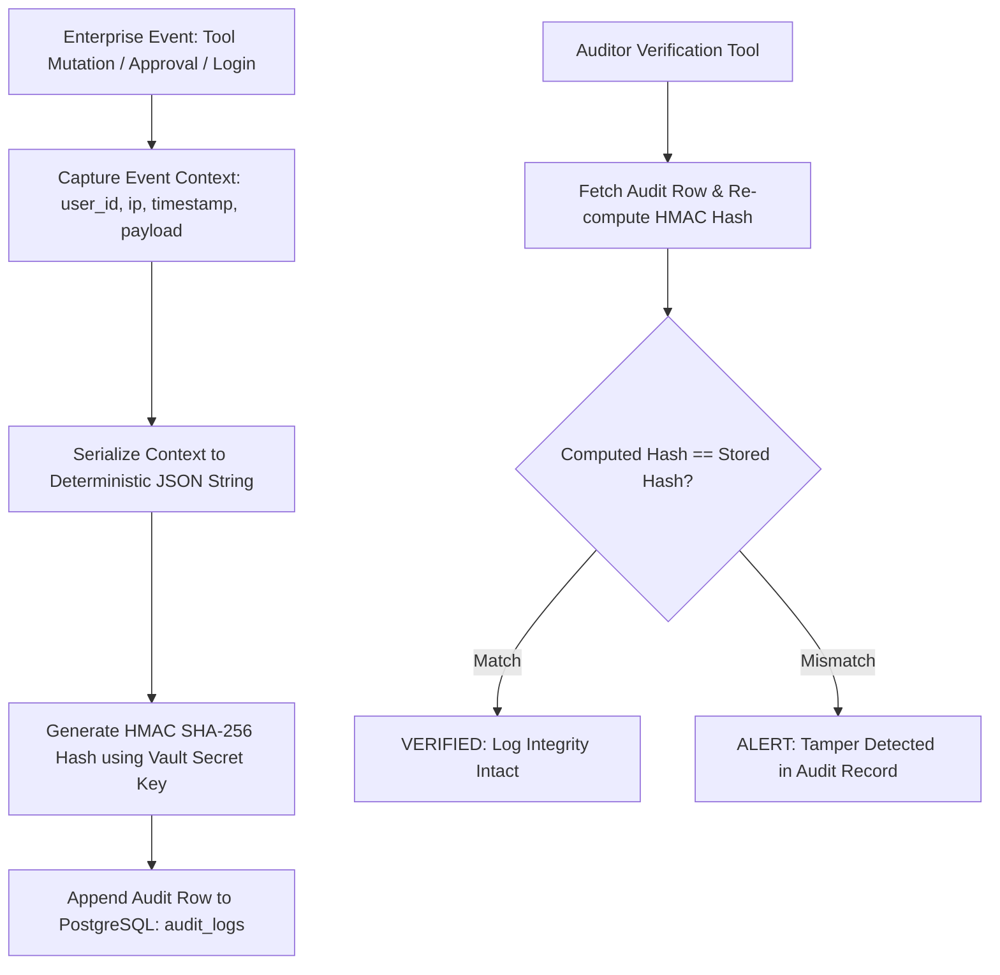

# Security — Immutable Audit Logging & Cryptographic Ledger

## Status
**Status:** ✅ IMPLEMENTED (HMAC SHA-256 Tamper-Proof Audit Table)

---

## 1. Audit Logging Architecture

Every critical action, tool mutation, multi-agent step, human approval decision, and authentication event in OmniAgent AI is recorded in an **Immutable Audit Ledger**. Each row is sealed with a cryptographic HMAC signature preventing log tampering.



---

## 2. Audit Record Schema

```json
{
  "audit_id": "audit_881920",
  "tenant_id": "ten_001928",
  "user_id": "usr_99120481",
  "event_type": "APPROVAL_DECISION_SUBMITTED",
  "resource_type": "workflow_run",
  "resource_id": "wf_run_991823",
  "ip_address": "192.168.1.104",
  "action_payload": {
    "approval_id": "appr_771829",
    "decision": "APPROVED",
    "tool_executed": "erp.post_invoice",
    "amount": 14250.00
  },
  "created_at": "2026-08-15T14:35:12.190Z",
  "hmac_signature": "f9e2b104c8a2e410b659c218204918ef0291823812984019283019283019283a"
}
```
