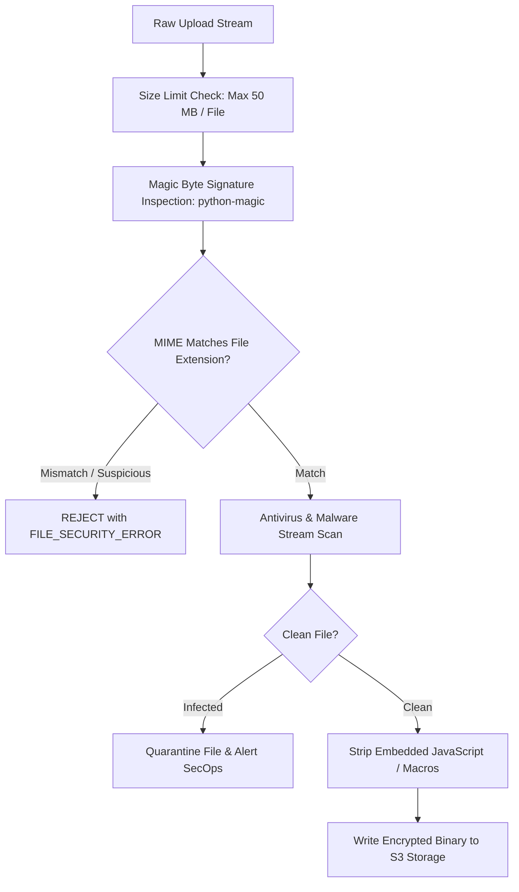

# Security — File Validation, Antivirus & Upload Sandboxing

## Status
**Status:** ✅ IMPLEMENTED (MIME Magic Inspection & Sandboxed Extraction)

---

## 1. File Upload Defense Pipeline

Accepting user-uploaded files exposes enterprise servers to buffer overflows, malicious macro execution, PDF script injection, and server-side request forgery (SSRF). OmniAgent AI processes all uploads through an isolated validation sandbox.

---

## 2. Whitelisted MIME Signatures

| File Type | Allowed Extensions | Verified Magic Bytes / MIME |
| :--- | :--- | :--- |
| **PDF Document** | `.pdf` | `%PDF-` / `application/pdf` |
| **Word Document** | `.docx` | `PK\x03\x04` / `application/vnd.openxmlformats-officedocument...` |
| **Excel Spreadsheet** | `.xlsx`, `.csv` | `PK\x03\x04` / `application/vnd.openxmlformats-officedocument...` |
| **Raster Images** | `.png`, `.jpg`, `.jpeg`, `.webp` | `\x89PNG`, `\xFF\xD8\xFF` / `image/png`, `image/jpeg` |
| **Audio Clips** | `.wav`, `.mp3`, `.m4a` | `RIFF`, `ID3` / `audio/wav`, `audio/mpeg` |
