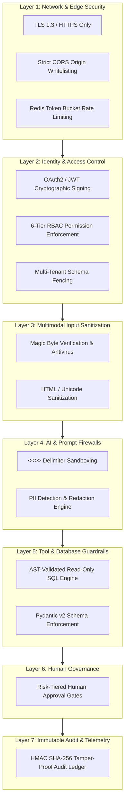

# Security — Enterprise Security Architecture & Defense-in-Depth

## Status
**Status:** ✅ IMPLEMENTED (Zero-Trust Enterprise Architecture)

---

## 1. Defense-in-Depth Architecture

OmniAgent AI is designed from the ground up on **Zero-Trust Principles**. No request, prompt, file, or agent tool invocation is inherently trusted. Security is enforced through seven concentric protection layers.

---

## 2. Enterprise Security Matrix

| Threat Vector | Mitigation Mechanism | Verification Method |
| :--- | :--- | :--- |
| **Indirect Prompt Injection** | Delimiter token isolation & passive data framing. | Adversarial red-team test suite. |
| **Unauthorized Tool Execution**| Authenticated session scopes & user role matching. | Unit tests & integration authorization tests. |
| **Malicious File Uploads** | Magic byte inspection, AV scanning, SVG/HTML sanitization. | MIME verification tests. |
| **SQL Injection** | AST parser blocking DDL/DML; parametrized query execution. | SQLmap & static code analysis. |
| **Data Leakage Across Tenants**| Mandatory tenant_id predicate on every DB & vector query. | Automated multi-tenant leakage integration tests. |
| **Audit Tampering** | Cryptographic HMAC signature over audit rows. | Cryptographic verification tool. |
