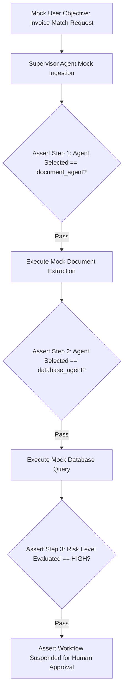

# Testing — Multi-Agent Trajectory Testing & Mocking

## Status
**Status:** ✅ IMPLEMENTED (Deterministic LLM Mocking & LangGraph Step Assertions)

---

## 1. Multi-Agent Evaluation Strategy

Testing stateful multi-agent DAGs requires asserting both the **intermediate routing trajectory** and the **final output accuracy**.



---

## 2. Deterministic Tool Mocking

```python
import pytest
from app.agents.supervisor import SupervisorAgent

@pytest.mark.asyncio
async def test_supervisor_routes_invoice_correctly(mock_llm_gateway):
    supervisor = SupervisorAgent(llm_gateway=mock_llm_gateway)
    state = await supervisor.plan_task("Verify invoice INV-8812 and post to ERP")
    
    # Assert planned agent execution order
    assert state["plan"][0]["agent"] == "document_agent"
    assert state["plan"][1]["agent"] == "database_agent"
    assert state["plan"][2]["agent"] == "reasoning_agent"
```
