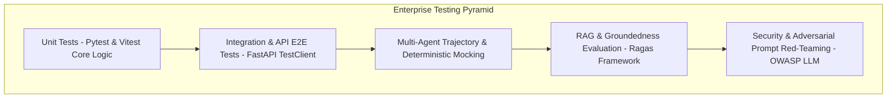

# Testing — Enterprise Testing Strategy & Verification Matrix

## Status
**Status:** ✅ IMPLEMENTED (Test Pyramid: Unit, Integration, Agent, RAG & Security)

---

## 1. Testing Pyramid Overview

OmniAgent AI enforces a comprehensive testing regime combining traditional deterministic software testing with specialized probabilistic AI evaluation frameworks (RAG groundedness, agent trajectory verification, and prompt injection red-teaming).



---

## 2. Test Suite Execution Commands

```bash
# 1. Run Backend Unit & Integration Tests
pytest tests/unit tests/integration -v --cov=app

# 2. Run Multi-Agent Deterministic Trajectory Tests
pytest tests/agents -v

# 3. Run Ragas Groundedness & Relevance Evaluation
python tests/eval/run_ragas_eval.py

# 4. Run Frontend Vitest Unit Tests
cd frontend && npm run test
```
