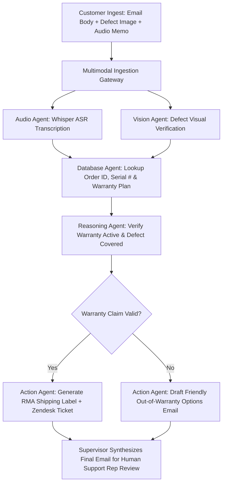

# Workflows — Multimodal Customer Support & Warranty Claim Triage

## Status
**Status:** ✅ IMPLEMENTED

---

## 1. Support & Warranty Triage Architecture

```mermaid
flowchart TD
    A[Customer Ingest: Email Body + Defect Image + Audio Memo] --> B[Multimodal Ingestion Gateway]
    
    B --> C[Audio Agent: Whisper ASR Transcription]
    B --> D[Vision Agent: Defect Visual Verification]
    
    C & D --> E[Database Agent: Lookup Order ID, Serial # & Warranty Plan]
    
    E --> F[Reasoning Agent: Verify Warranty Active & Defect Covered]
    
    F --> G{Warranty Claim Valid?}
    
    G -->|Yes| H[Action Agent: Generate RMA Shipping Label + Zendesk Ticket]
    G -->|No| I[Action Agent: Draft Friendly Out-of-Warranty Options Email]
    
    H & I --> J[Supervisor Synthesizes Final Email for Human Support Rep Review]
```
