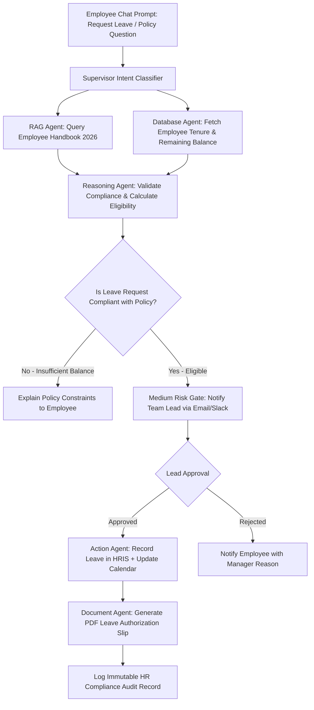

# Workflows — HR Employee Leave, Policy Q&A & Document Generation

## Status
**Status:** ✅ IMPLEMENTED

---

## 1. HR Policy Synthesis & Leave Booking DAG

```mermaid
flowchart TD
    A[Employee Chat Prompt: Request Leave / Policy Question] --> B[Supervisor Intent Classifier]
    
    B --> C[RAG Agent: Query Employee Handbook 2026]
    B --> D[Database Agent: Fetch Employee Tenure & Remaining Balance]
    
    C --> E[Reasoning Agent: Validate Compliance & Calculate Eligibility]
    D --> E
    
    E --> F{Is Leave Request Compliant with Policy?}
    
    F -->|No - Insufficient Balance| G[Explain Policy Constraints to Employee]
    F -->|Yes - Eligible| H[Medium Risk Gate: Notify Team Lead via Email/Slack]
    
    H --> I{Lead Approval}
    I -->|Approved| J[Action Agent: Record Leave in HRIS + Update Calendar]
    I -->|Rejected| K[Notify Employee with Manager Reason]
    
    J --> L[Document Agent: Generate PDF Leave Authorization Slip]
    L --> M[Log Immutable HR Compliance Audit Record]
```
