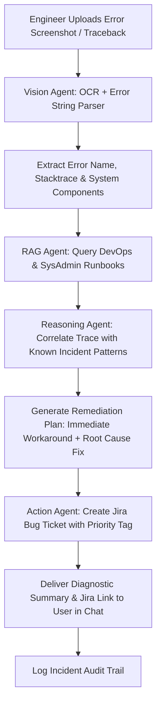

# Workflows — IT Support Screenshot Error Diagnosis & Ticket Automation

## Status
**Status:** ✅ IMPLEMENTED

---

## 1. IT Incident Triage Flow

```mermaid
flowchart TD
    A[Engineer Uploads Error Screenshot / Traceback] --> B[Vision Agent: OCR + Error String Parser]
    B --> C[Extract Error Name, Stacktrace & System Components]
    
    C --> D[RAG Agent: Query DevOps & SysAdmin Runbooks]
    D --> E[Reasoning Agent: Correlate Trace with Known Incident Patterns]
    
    E --> F[Generate Remediation Plan: Immediate Workaround + Root Cause Fix]
    
    F --> G[Action Agent: Create Jira Bug Ticket with Priority Tag]
    G --> H[Deliver Diagnostic Summary & Jira Link to User in Chat]
    H --> I[Log Incident Audit Trail]
```
