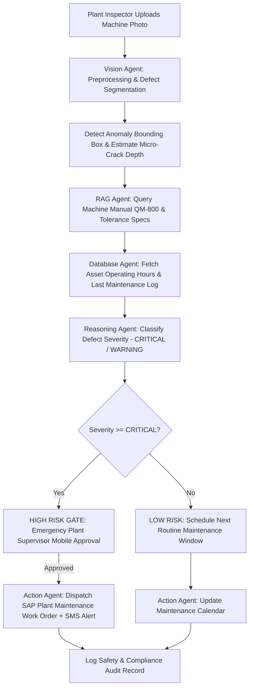

# Workflows — Manufacturing Machinery Inspection & Maintenance

## Status
**Status:** ✅ IMPLEMENTED

---

## 1. Machinery Inspection DAG

```mermaid
flowchart TD
    A[Plant Inspector Uploads Machine Photo] --> B[Vision Agent: Preprocessing & Defect Segmentation]
    B --> C[Detect Anomaly Bounding Box & Estimate Micro-Crack Depth]
    
    C --> D[RAG Agent: Query Machine Manual QM-800 & Tolerance Specs]
    D --> E[Database Agent: Fetch Asset Operating Hours & Last Maintenance Log]
    
    E --> F[Reasoning Agent: Classify Defect Severity - CRITICAL / WARNING]
    
    F --> G{Severity >= CRITICAL?}
    
    G -->|Yes| H[HIGH RISK GATE: Emergency Plant Supervisor Mobile Approval]
    G -->|No| I[LOW RISK: Schedule Next Routine Maintenance Window]
    
    H -->|Approved| J[Action Agent: Dispatch SAP Plant Maintenance Work Order + SMS Alert]
    I --> K[Action Agent: Update Maintenance Calendar]
    
    J & K --> L[Log Safety & Compliance Audit Record]
```
