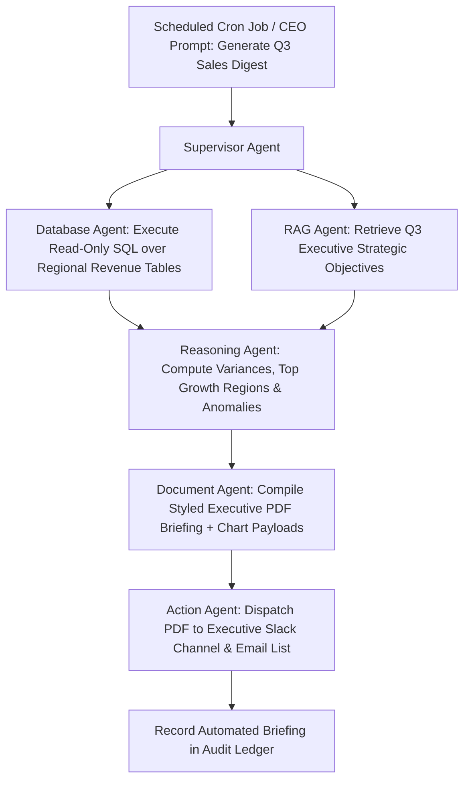

# Workflows — Automated Business Reporting & Executive Briefings

## Status
**Status:** ✅ IMPLEMENTED

---

## 1. Executive Reporting Pipeline

```mermaid
flowchart TD
    A[Scheduled Cron Job / CEO Prompt: Generate Q3 Sales Digest] --> B[Supervisor Agent]
    
    B --> C[Database Agent: Execute Read-Only SQL over Regional Revenue Tables]
    B --> D[RAG Agent: Retrieve Q3 Executive Strategic Objectives]
    
    C --> E[Reasoning Agent: Compute Variances, Top Growth Regions & Anomalies]
    D --> E
    
    E --> F[Document Agent: Compile Styled Executive PDF Briefing + Chart Payloads]
    
    F --> G[Action Agent: Dispatch PDF to Executive Slack Channel & Email List]
    G --> H[Record Automated Briefing in Audit Ledger]
```
